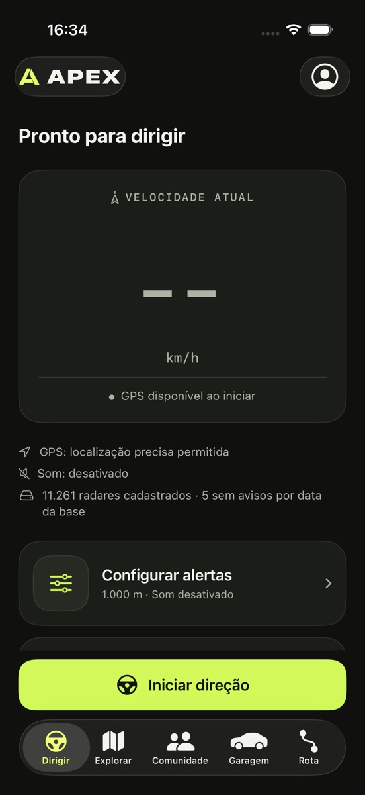
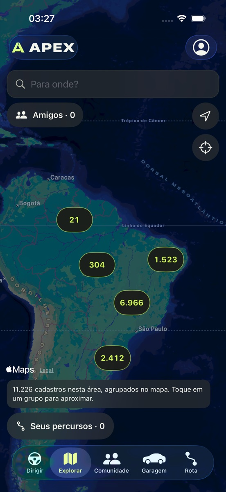
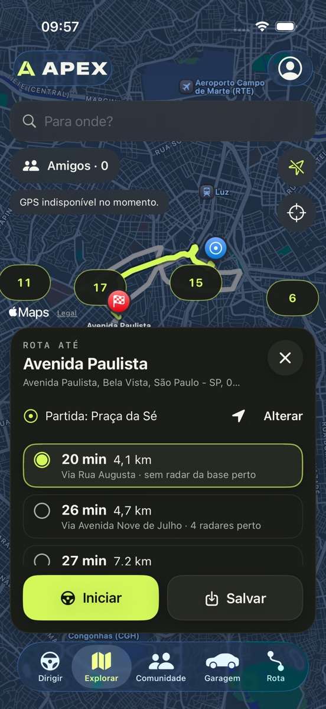
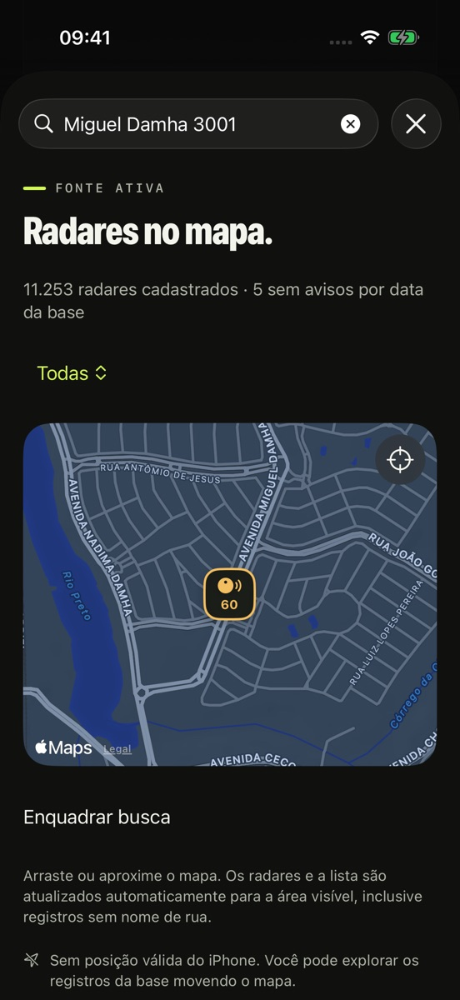
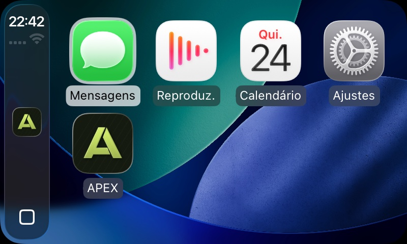

# APEX

**Para quem gosta de dirigir.**

Velocímetro por GPS com alertas de radar pela via e pelo sentido, rotas gravadas, garagem e
comunidade com amigos no mapa. Nativo no iPhone, no CarPlay e no Android.

---

## 📸 Capturas de tela

| Dirigir | Explorar | Rota | Radares no mapa |
|:---:|:---:|:---:|:---:|
|  |  |  |  |

## ✨ Funcionalidades

### 🚗 Dirigir
- **Velocidade por GPS** com aviso por voz e bipe acima do limite.
- **Alerta só dos radares da sua via e do seu sentido**, também em segundo plano.

### 📡 Radares
- Base de todo o Brasil **offline** e **atualizada todo dia** a partir de dados abertos.
- Conferida com **cadastros oficiais**: CET, DER-SP, ANTT e prefeituras.

### 🗺️ Explorar e rotas
- Busca de destino com **rotas alternativas** e os radares de cada caminho.
- **Gravação e histórico** de percursos e importação de **GPX**.

### 🤝 Comunidade
- **Amigos no mapa**, grupos, encontros, chat e **Largada**: contagem 3, 2, 1, VAI para pista fechada.

### 🚘 CarPlay
- App nativo no carro e **painel de velocidade e radar no Dashboard**.

## 🔐 Privacidade

- A localização só é compartilhada com os amigos que você escolher, pelo prazo que escolher (15 minutos, 1 hora ou 2 horas) e com o app aberto.
- Rotas, garagem e perfil ficam no aparelho. O backup é local e cifrado.
- A base de radares só é baixada: o app nunca envia a sua posição para atualizá-la.

## 🧰 Stack

| Plataforma | Tecnologia |
|---|---|
| iPhone | **Swift** · SwiftUI · SwiftData · MapKit |
| CarPlay e Dashboard | CarPlay (Driving Task) · ActivityKit |
| Android | **Kotlin** · Jetpack Compose · MapLibre |
| Backend | **Supabase**: Postgres, Auth, Storage, Realtime e Edge Functions |
| Dados de radar | Python · GitHub Actions · OpenStreetMap e cadastros oficiais |

## 🗺️ Status

Em teste fechado: iPhone pelo TestFlight e Android por APK. Ainda não está na App Store nem no
Google Play. O código é privado.

APEX · SwiftUI + Jetpack Compose + Supabase

